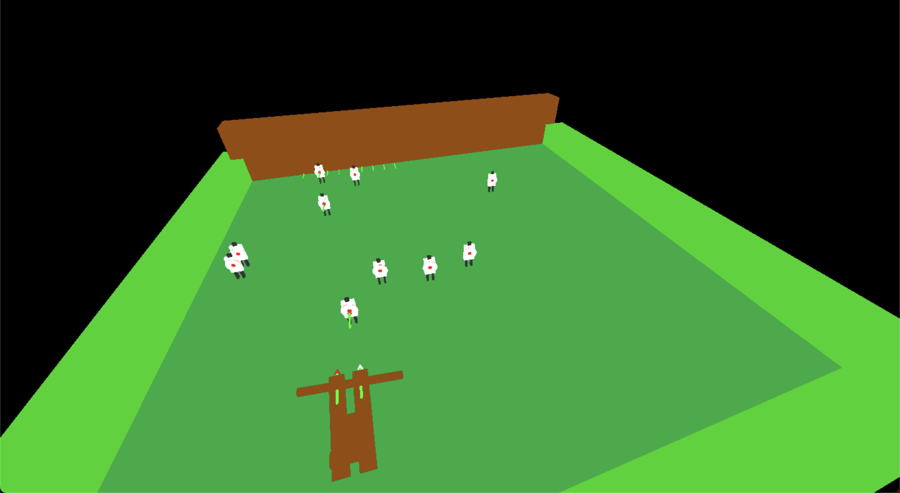

# Archery Game
> Este projecto consitste no desenvolvimento de jogo de tiro para a web

## Objectivos
1. compreender e implementar a arquitectura de uma aplicação gráfica interativa
e explorar os conceitos básicos de modelação geométrica (por instanciação de
primitivas).
2. Compreender e criar protótipos validos antes da implementação
A avaliação do primeiro trabalho corresponde a 5 valores da nota do Projecto

Tarefas

1. Modelar em Three.js os seguintes objectos (Uma besta, alvos redondos, alvo humano, além de detalhes para melhorar a cena esteticamente). Fo-
tos em anexos

2. Definir também uma câmara fixa com uma vista de topo sobre a cena utilizando uma projecção ortogonal que mostre toda a cena usando a tecla ‘1’.

3. Definir mais duas câmaras fixas com vistas lateral e frontal utilizando sempre projecções ortogonais. Para selecionar qual das câmaras está activa

usam-se as teclas ‘1’ a ‘3’. A representação visual destes objectos deve alter-
nar entre modelo de arames e sólida usando a tecla ‘4’ (Ver exemplo 3 dos

exercícios, Tecla ‘A’).

4. Permitir ao utilizador movimentar a besta com o teclado utilizando as te-
clas das setas para virar para esquerda ‘ <- ‘ e direita ‘->’. A besta deve apre-
sentar um movimento a velocidade constante, sendo a direcção do movimen-
to dada por um vector tridimensional. O cálculo do movimento deve ter em

consideração que o utilizador pode carregar em várias teclas em simultâneo

além de levar em consideração o atrito (Usar a física). Aos alvos deve move-
rem-se sozinhos de um extremo da cena a outro (Movimento deve ser aleató-
rio, além de ser possível mudar de alvo redondo para alvo humano usando a

Tecla ’M’).





## Exemplo de uso

Na pasta simple contém um exemplo e html, sendo necessário apenas abrir o ficheiro

Na pasta besta contêm a versão base com projecto

```sh
cd besta
npm install
npm run start
```

Depois abrir no navegador com a url presente no terninal


## Contributing

1. Faça o _fork_ do projeto 
2. Crie uma _branch_ para sua modificação (`git checkout -b feature/fooBar`)
3. Faça o _commit_ (`git commit -am 'Add some fooBar'`)
4. _Push_ (`git push origin feature/fooBar`)
5. Crie um novo _Pull Request_


